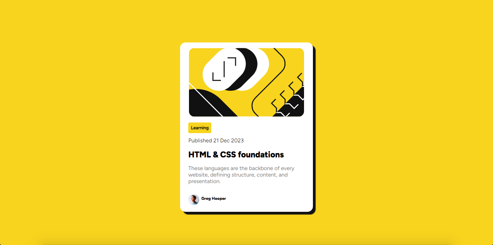

# Frontend Mentor - Social links profile solution

This is a solution to the [Social links profile challenge on Frontend Mentor](https://www.frontendmentor.io/challenges/social-links-profile-UG32l9m6dQ). Frontend Mentor challenges help you improve your coding skills by building realistic projects. 

## Table of contents

- [Overview](#overview)
  - [The challenge](#the-challenge)
  - [Screenshot](#screenshot)
  - [Links](#links)
- [My process](#my-process)
  - [Built with](#built-with)
  - [What I learned](#what-i-learned)
- [Author](#author)

**Note: Delete this note and update the table of contents based on what sections you keep.**

## Overview

### The challenge

Users should be able to:

- See hover and focus states for all interactive elements on the page

### Screenshot



### Links

- Solution URL: [Add solution URL here](https://your-solution-url.com)
- Live Site URL: [Add live site URL here](https://your-live-site-url.com)

## My process

### Built with

- Semantic HTML5 markup
- CSS custom properties
- Mobile-first workflow
- Flexbox

### What I learned

```html
 <div class="name-img">
    <div class="main-img">
        
    </div>
    <div class="main-name">
      Greg Hooper
    </div> 
  </div>   
```
```css

.main-img img{
    width: 32px;
    height: 32px;
}

.main-name{
    display: inline-block;
    text-align: center;
    font-family: "Figtree-Extra";
    padding: 0.5em;
    font-size: 0.75em;
}
```

## Author

- Github - [Rakhat Zhumabek](https://github.com/R3iwan)
- Frontend Mentor - [@R3iwan](https://www.frontendmentor.io/profile/R3iwan)

